# Introduction

###### I state that this analysis should be understood as a simple data manipulation exercise, instead of as a study of any utility.

***

The following document aims to analyze the trend of the COVID-19 pandemic in Italy, drawing on the net data that has been provided until 31-March-2020.

I will analyze the following phases:

1. Understanding the problem

2. Data acquisition
    * Data cleaning
    * Data exploration & Feature Engineering
3. Predictive Modeling
4. Data Visualization
5. Conclusions

# Understanding the problem

The situation is complex as it is rich in variables, therefore the analysis of the spread of this pathology requires an understanding of:

* reliability of the data provided and on which it is necessary to operate;
* type of disease.

#### Are the data reliable?

This point must take into consideration two aspects:

1. the data collection protocol between different States;

2. on the other hand with the same protocol (ie within the same country) what percentage of cases can the data collected cover? (ie many people have gone through quarantine and illness in solitude, many are asymptomatic);

The answer to these two questions is likely to invalidate any analysis, or give results that are not credible or usable, comparable to a dice roll.

> 1. The data I have collected so far, based on the information received from the official media, lead me to think that the protocols between the various States are not uniform, as the attribution of a death for COVID-19 is not is equal, the number of swabs performed are not proportionally equal. For this reason I believe it is not possible to treat two States within the same analysis, and I will limit my case study to the Italian State only.
> 2. As for the amount of data collected, not having the possibility of knowing whether the data provided is adequate, I'm taking the chance that's entirely true, and I will operate on the data provided by the official national sources.

#### The illness

Viral agent that aggressively attacks the respiratory system, causing within a certain percentage, an aggravation of the therapeutic situation, changing into an interstitial pneumonia, up to, in the most serious cases, the death of the patient.

> Even if the analysis of the problem is limited to the Italian State only, the evolution of the pandemic is very different. This leads me to think that a different evolution, with the same care, containment and recognition protocols, is caused by different situations between the various Italian regions. Pathogens proliferate in situations suitable for their reproduction, if the diffusion is different in two population groups, perhaps the cause should be sought in the population.
>
> A starting point for this consideration was provided by these two photos:
>
> 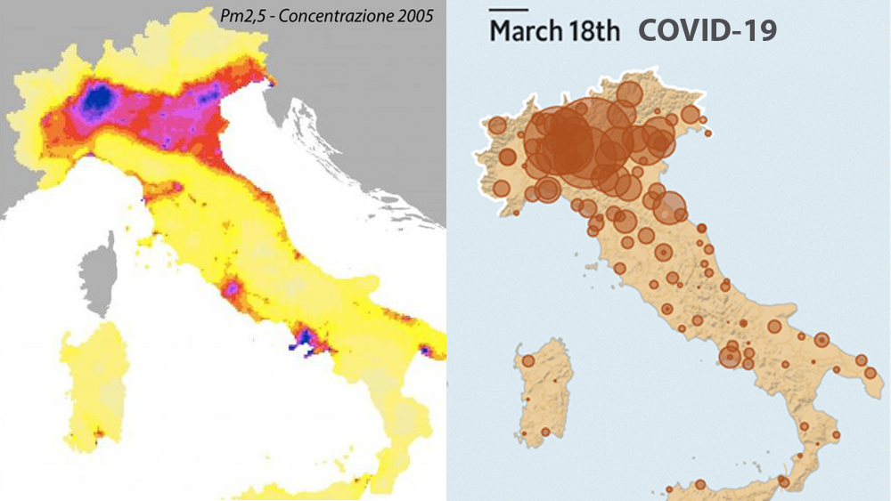
>
> The photos without many analyzes demonstrate at least a similarity, perhaps not yet demonstrable, but certainly sufficient to start an analysis. Although the photo concerning the analysis of PM2.5 concentration is dated 2005, any damage to the respiratory system cannot be recovered in 10/15 years, assuming that the situation has improved.
>
> The question I asked myself was:
>
> *"... can a virus that attacks the respiratory system find optimal condition in a population that lives by breathing air that is harmful to the respiratory system itself?"*
>
> Deepening this theme I found some articles:
>
> https://www.lifegate.com/people/news/air-pollution-europe-eea
>
> http://www.ilmessengero.it/category/italia/
>
> https://www.agi.it/cronaca/ecco_come_abbattere_lo_smog_in_citt_il_decalogo_di_legambiente-1347212/news/2017-01-05/
>
> https://nova.ilsole24ore.com/infodata/scopri-la-mappa-mondiale-dellinquinamento-dellaria-nelle-citta/?refresh_ce=1
>
> https://www.repubblica.it/ambiente/2019/11/14/news/italia_prima_in_europa_per_le_morti_da_polveri_sottili-241031894/
>
> And from official government sources:
>
> http://www.salute.gov.it/imgs/C_17_paginaRelazione_1438_listaFile_itemName_2_file.pdf
>
> 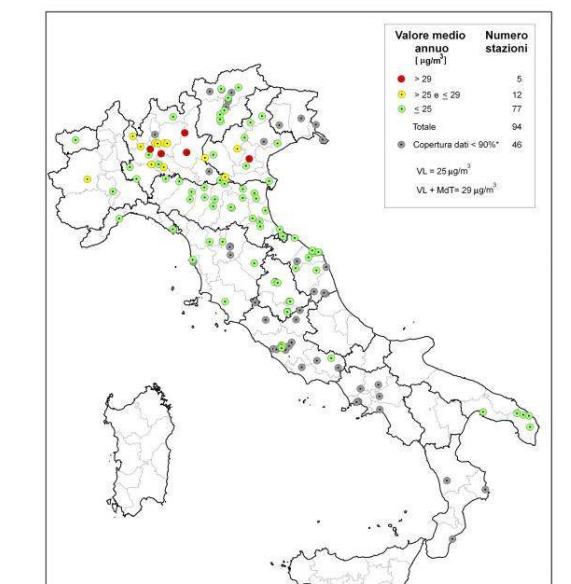

#### Conclusions

#### Conclusions

The goal of this analysis will be:

* analyze the progress of the pandemic;
* analyze the diffusion on the Italian territory;
* find correlations between air pollution and the death rate from interstitial pneumonia caused by COVID-19 in regions of Italy alone.

The model found can be applied to data from other individual states, so that protocols do not distort the results.

#### The data on COVID19

As for the disease data, I cannot use on those provided by **[John Hopkins CSSE](https://github.com/CSSEGISandData/COVID-19/tree/master/csse_covid_19_data/csse_covid_19_time_series)** because they are differentiated for the various Italian regions.

The data were acquired through the Github profile of the Prime Minister's Office - Italian Civil Protection Department, in the section relating to [COVID-19](https://github.com/pcm-dpc/COVID-19/tree/master/dati-regioni). As far as my analysis is concerned, I downloaded them and they are also available in the [Data](Data/Covid19).

#### The data relating to air pollution

Air pollution data have been taken from the [ISPRA](https://annuario.isprambiente.it/ada/basic/7080), in the folder [Data](Data/air_pollution_data) the original documents and datasets extrapolated from me. I also found the data of the [Eupean Environmental Agency](https://www.eea.europa.eu/data-and-maps/data/air-pollutant-concentrations-at-station) relating to the years from 2010 -2016, however I have not used them because they have many incomplete fields. I leave the reference for any cross-checks.

#### The data relating to the demographic distribution

I believe that dimensioning the disease data to the total population is of primary importance, as the regions differ considerably by population. The data were acquired from the [IStat](http://dati.istat.it/Index.aspx?QueryId=18545) and were grouped in a table in csv format in the [Data](Data/demographic_data).

### Data Cleaning

In this phase I will go to examine the various datasets to check for missing or incorrect values.

The operations concerning this phase will be collected in an ipynb file ([data_cleaning.ipynb](data_cleaning.ipynb)) in the main directory.

### Data exploration & Feature Engineering

The objective of this phase is to understand what values I can use and if necessary create new data by relating various values, combining everything in a table where it is possible.

As for the COVID data, I will keep only the number of the deceased, as the number of infected people is not reliable. In fact, no swabs were made to the whole population, therefore the number of infected people is unknown. Furthermore, the presence of people who are totally asymptomatic makes the analysis even more complicated.

The value concerning the number of hospitalized people is also difficult to use, as the number of places available in hospitals is difficult to recover and is not always proportional to the number of inhabitants. For these reasons I will not even consider this value.

The number of deaths per region will be related to the number of inhabitants, in a subsequent analysis I will also insert the population density by region.

I will also add the column for air pollution and the label for exceeding the limit allowed by law. If a region contains more than one data, the data will be grouped and the median will be taken.

The operations regarding this phase will be collected in an ipynb file ([making_main_table.ipynb](making_main_table.ipynb)) in the main directory.

### Conclusions regarding data exploration

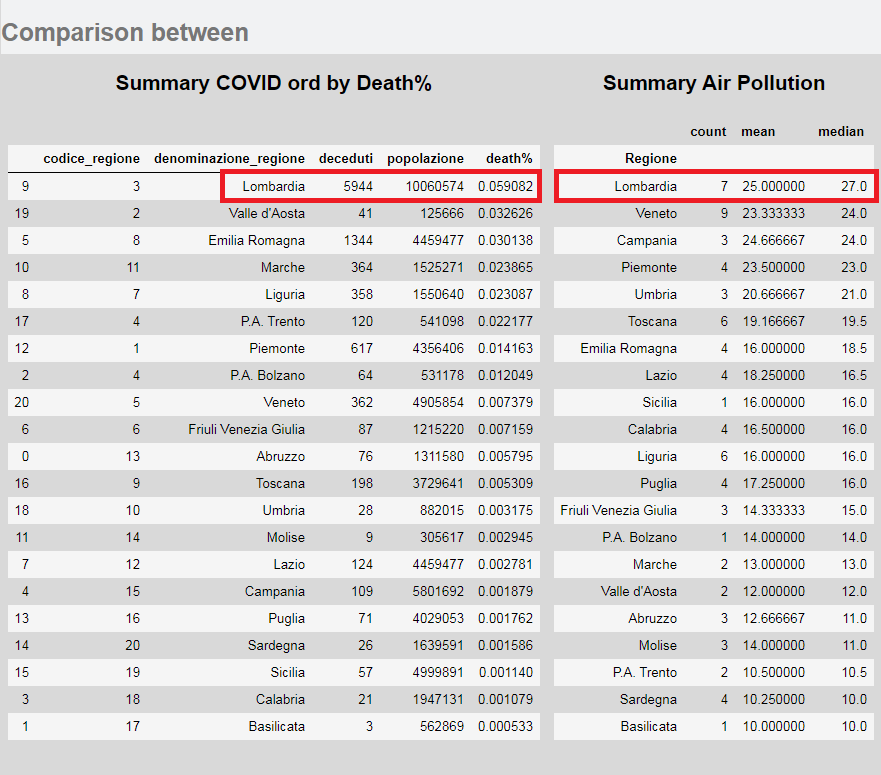

These two tables summarize the data on which I will carry out the initial analyzes and which I will summarize in some graphs.

It can be noted that Lombardy is at the top of both lists: one relating to deaths as a percentage, absolute deaths and the other relating to pollution (the polluting figure refers to the 50th percentile).

The data provided by the Civil Protection are divided into two large datasets:

* one that contains the history by region of cases ascertained, hospitalized, hospitalized, intensive care, isolation and the deceased
* one that contains the history by province which, unlike the previous one, is not as detailed and only has the history of the number of cases ascertained by province.

The number of deceased will be analyzed for the reasons previously expressed. For now I will not consider the provincial data.

***

The following graphs represent the evolution of 6 regions, Lombardy was the forerunner, together with Emilia Romagna, of the Italian case, but on the contrary of Emilia Romagna it was the region that underwent the greatest number of cases and losses so far.

Restrictive measures were initially adopted in Lombardy which after a few weeks were extended to the rest of Italy. The central aspect remains the difference in evolution between this region and the others, we must remember that:

* on the day of the communication of the closure of the Lombard borders there was an exodus of people, who moved from Lombardy to other regions of Italy, despite this shift there was no spread or an increase in cases exponentially, as expected after this behavior;
* several regions have not strictly respected government measures and yet there has not been a diffusion at least equal to that which occurred in Lombardy.

These two points suggest that in this region there is one or more factors that make the virus particularly dangerous.

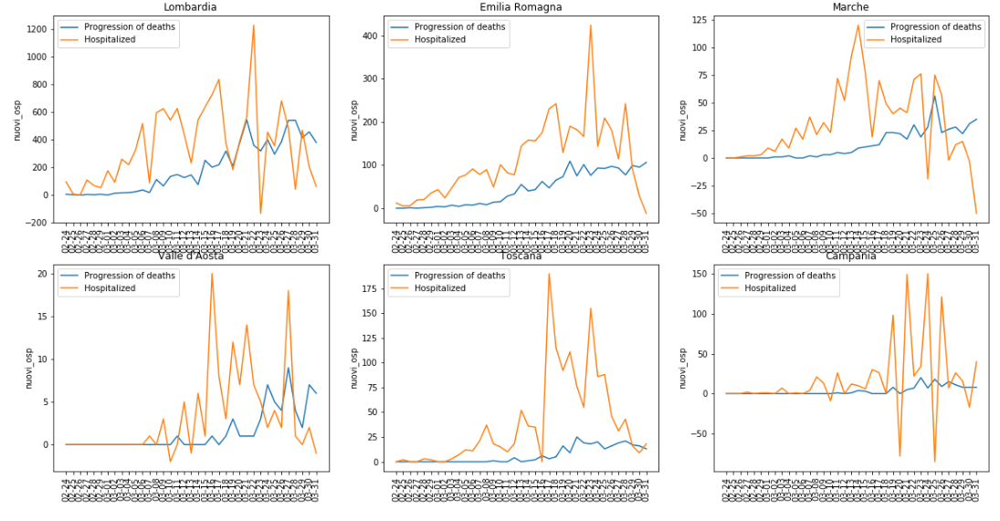

The **<u>data of the following chart have been proportioned according to the population</u>** of the individual regions.

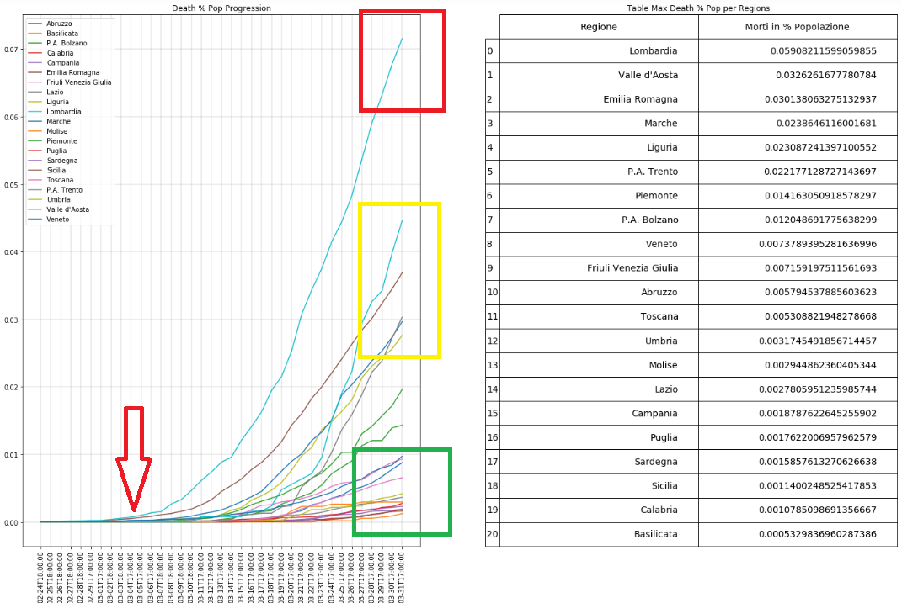

From this first graph you can begin to hypothesize approximately 3 groups:

* Lombardy
* Emilia Romagna, Marche, Aosta Valley, Liguria, P.A. Trento, Piedmont
* The rest of Italy

The most prominent aspect is that indicated by the red arrow, the first cases appear at the same time in Lombardy and Emilia (Codogno and the neighboring villages are on the border of the two regions), however in Lombardy it has had an important diffusion, while in Emilia it remains much more contained.

We proceed with the study of the correlation between pollution and deaths. I placed a heatmap side by side with a simple scatterplot to get a clearer view of the two graphs.

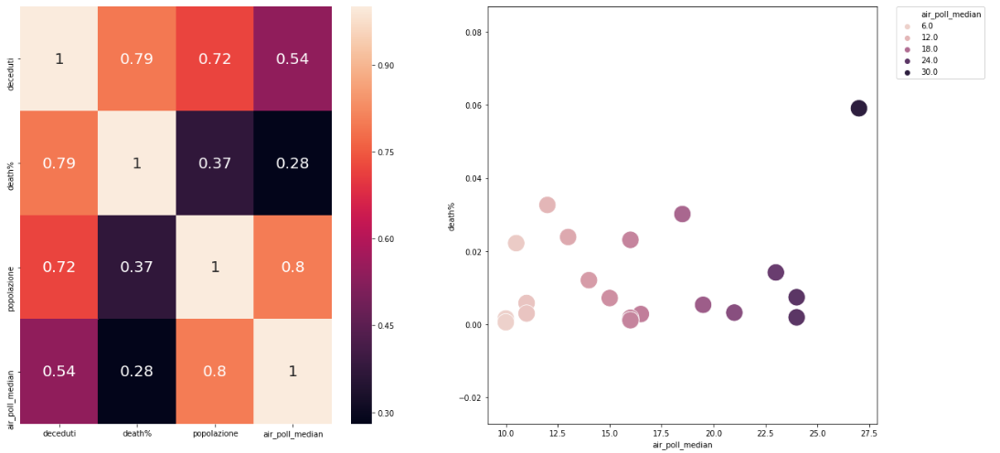

As for <u>deaths and polluting</u> the correlation value is <u>0.54</u>, which can be considered moderately correlated, obviously it must be remembered that the ["correlation does not imply the cause"](https : //en.wikipedia.org/wiki/Correlation_does_not_imply_causation), in other words: it is not said that it is the cause but it could be one of the predisposing factors, or a contributing factor, which makes the pathology even more deleterious. Other useful data to get a better picture could be:

* the **population density**, possibly subdivided by registry bands;
* the **age of the deceased**;
* **an index that expresses the health response capacity of the cities/region** (ie number of beds in intensive care, reachability of patients by the rescue and health service)

Data that for now I am not able to obtain.

It should be noted that <u>the pollution index is relative to the entire region</u>, in fact the sampling stations are often scattered throughout the territory. This implies that the pollution of heavily populated municipalities is often compensated by other sparsely populated ones where the pollution rate falls below the threshold. This aspect does not give the same weight to the influence that the pollution of large centers has on the population and on the general state of health.

|               | Population | Air Pollution |
| ------------- | ---------- | ------------- |
| city 1        | 1.000.000  | 100           |
| city 2        | 1.000      | 10            |
| city 3        | 1.000      | 10            |
| Normal mean   |            | 40            |
| Weighted mean |            | 99.8          |

$$
Weighted\ Average = \frac {\sum Wx}{\sum W}
$$

As soon as possible I will try to reformulate the regional data with a weighted average between population and pollution.

The following graphs refer to the pivot tables built on the deceased and expressed through clusterplots. I used two data sets one NOT proportionate to the population and one PROPORTIONAL to the population. I also made a normalized and non-normalized chart.

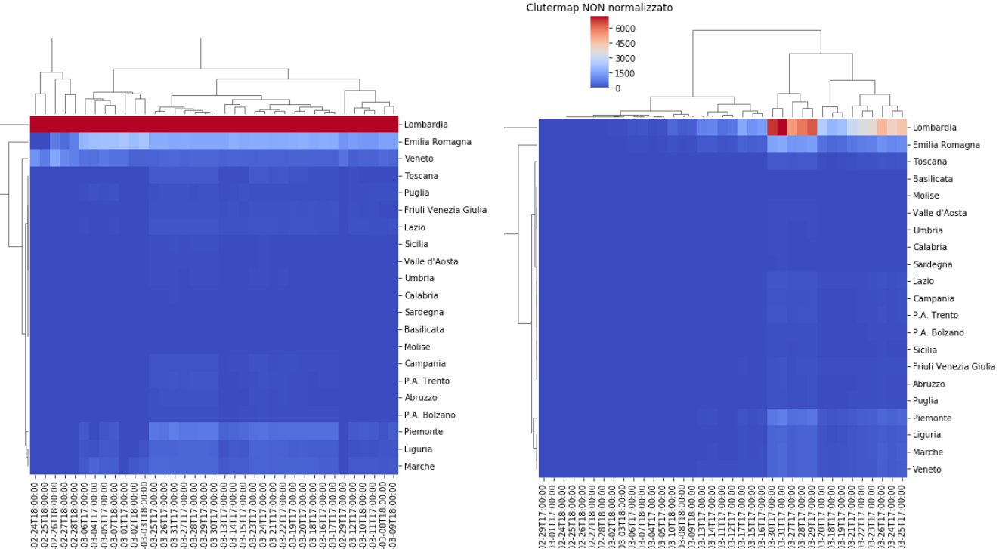

From these two graphs, the differentiation between the various groups is noticeable, the only region that stands out is always Lombardy.

Things change slightly by proportioning the data.

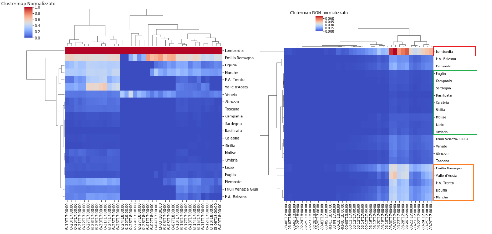

(To see the images in more detail consult the file making_main_table.ipynb in the main directory)

The proportionate data are, in my opinion, more visible.  The clustermap outline the presence of three main groups:

- Lombardy;
- Marche, Liguria, Valle d'Aosta, Piedmont, Trentino Alto Adige, Emilia Romagna and Veneto;
- the remaining Italian regions;

This subdivision can also be seen from the lineplot aside, although less clear.

Until now, the displayed data has not shown an evident relationship between pollution and death from Coronavirus interstitial pneumonia, however we remember that the Lombardy region, <u>the only one with a value higher than those permitted by law</u>, is the region that has suffered the greatest number of deaths attributed to the action of the virus.

***

Geoplot charts follow to get a clearer view of the data. I will use two different libraries with different approaches, on one side geopandas and on the other ipyleaflet

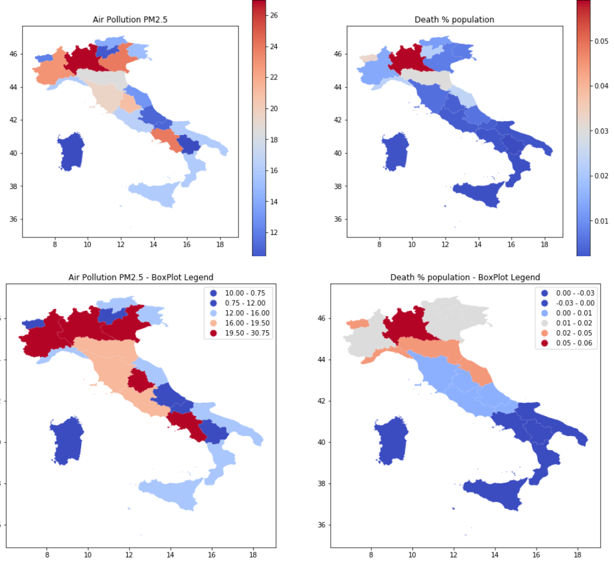

The first two graphs are represented with a color legend based simply on values, in the other two the data are divided into 5 classes using the Box Plot classifier (or "Box and wiskers plot"), which combines the minimum and maximum values (and then the interval) with the quartiles to highlight the dispersion index of the values

------

I will also do the same for the provinces, the database does not have numbers relating to deaths by province and I will have to use the value relating to the total number of cases. The problems are those discussed at the beginning: they are very relative data, like those of the infected, and above all in this case there are not even indications regarding the number of beds per province, but they are the only data in my possession to size the infection.

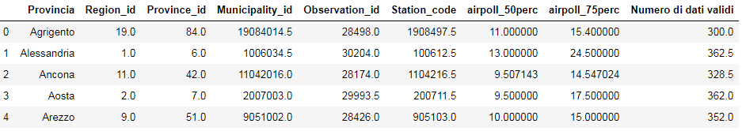

In this case I lack the data relating to the provincial population density, a value which, if put in relation to the pollution index, could express the weight that pollution expresses on the territory and on the people who live there.

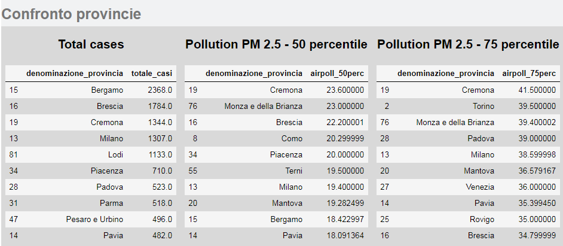

I also added the pollution value of the 75th percentile, to have a dimension of the pollution range, remember that the annual limit value for January 1, 2015 was set at 25 µg/m3, while by January 1, 2020 the value was been set at 20 µg/m3. (according to Legislative Decree 155/2010, I remember the report of the [ministry of the environment](http://www.salute.gov.it/imgs/C_17_paginaRelazione_1438_listaFile_itemName_2_file.pdf).)

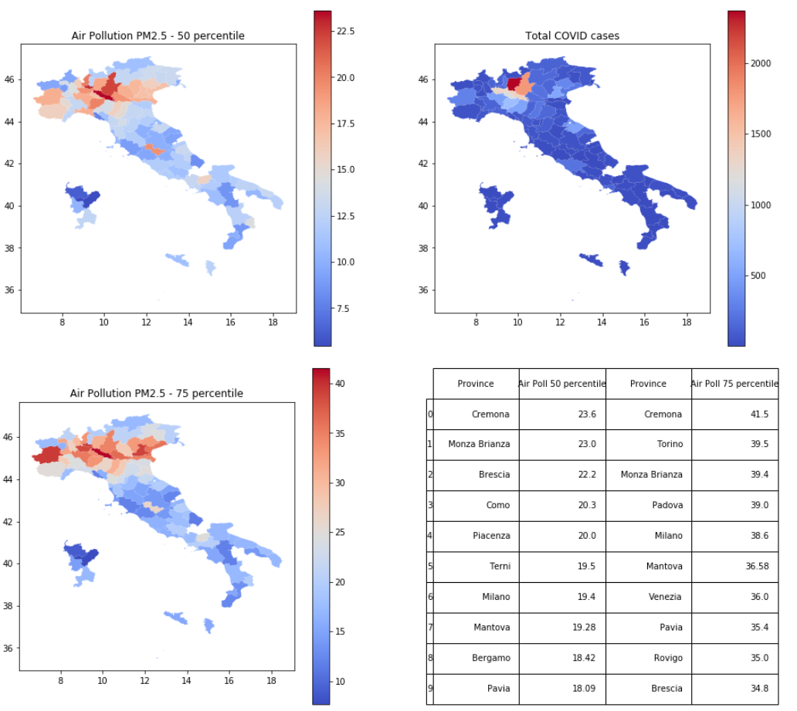

Also in this case these first three graphs are represented with a color legend based on the values, in the following the data are divided by the Box Plot classifier.

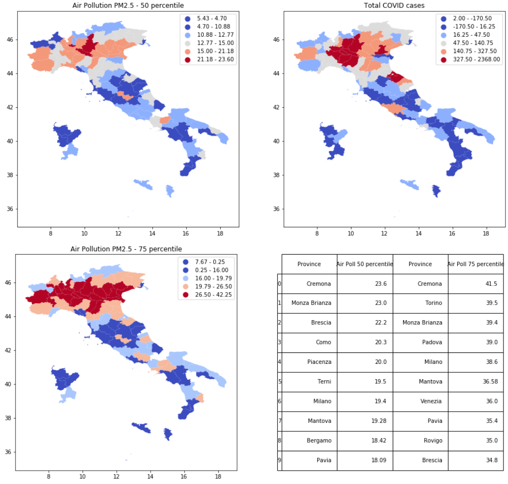

Finally, the latter graph created with the ipyleaflet module.

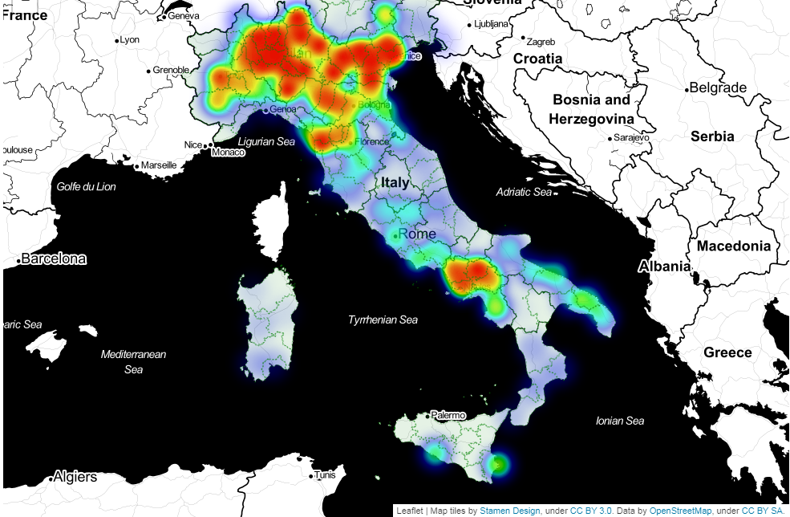

I modified the pollution index by multiplying it with the regional population, waiting to obtain the provincial data.

The data are relatively few and incomplete, and the epidemic is not yet concluded so it is not yet possible to understand whether the development that took place in Lombardy will replicate in the rest of Italy.

The next phase can allow to outline models to try to recognize the type of pathology development in the various regions.