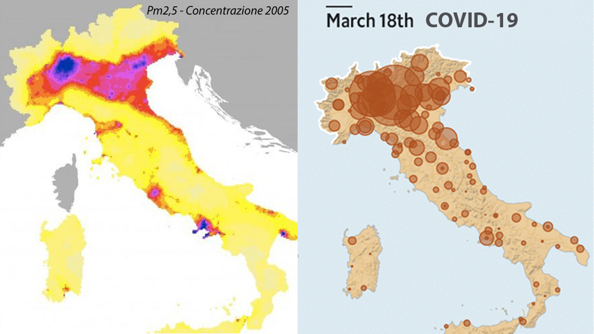

# Introduzione

Con il seguente documento si vuole analizzare l'andamento della pandemia COVID-19 in territorio italiano, attingendo dai dati che la rete fornisce ad oggi, 26-Marzo-2020.

Le fasi che analizzerò saranno le seguenti:

1. Comprensione del problema

2. Acquisizione dei dati
   * Data cleaning
   * Data exploration & Feature Engineering
3. Predictive Modeling
4. Data Visualization
5. Conclusioni

# Comprensione del problema

La situazione è complessa in quanto ricca di variabili, quindi l'analisi della diffusione di questa patologia richiede la comprensione della:

* affidabilità dei dati che vengono forniti e su cui bisogna operare;
* tipologia della malattia.

#### I dati sono affidabili?

Questo punto deve prendere a sua volta in considerazione due aspetti:

1. il protocollo di raccolta dati tra Stati differenti;

2. a parità di protocollo (ossia all'interno dello stesso Stato) i dati raccolti che percentuale di casi riescono a coprire;

La risposta di queste due domande domande rischiano di inficiare qualsiasi analisi, o dare dei risultati poco credibili o utilizzabili, paragonabili ad un tiro di dadi.

> 1. I dati da me raccolti sino a questo momento, sulla base delle informazioni pervenute dai media ufficiali, mi portano a pensare che i protocolli tra i vari Stati non sono uniformi, in quanto l'attribuzione di una morte per COVID-19 non è uguale, il numero di tamponi eseguiti non sono proporzionalmente uguali. Per questo motivo ritengo non sia possibile trattare due Stati all'interno della stessa analisi, e limiterò il mio caso di studio al solo Stato Italiano.
>
> 2. Per quanto riguarda la quantità di dati raccolti, non avendo la possibilità di sapere se i dati forniti siano adeguati, prendo per buono che lo siano, e opererò sui dati forniti dalle fonti ufficiali nazionali.

#### La malattia

Agente virale che attacca in maniera aggressiva il sistema respiratorio, causando entro una certa percentuale, un'aggravamento della situazione terapeutica mutando in una polmonite interstiziale, sino, nei casi più gravi, alla morte del paziente.

> Anche circoscrivendo l'analisi del problema al solo Stato Italiano l'evoluzione della pandemia risulta molto differente. Questo mi porta a pensare che un'evoluzione differente, a parità di protocolli di cura, contenimento e riconoscimento, sia causata da situazioni differenti tra le varie regioni italiane. Gli agenti patogeni prolificano in situazioni adatte alla loro riproduzione, se la diffusione è differente in due gruppi di popolazione, forse non bisogna cercare nel virus ma nella popolazione.
>
> Uno spunto per questa considerazione mi è stato fornito da queste due foto:
>
> 
>
> Le foto senza bisogno di molte analisi dimostrano quantomeno una somiglianza, magari non ancora dimostrabile, ma sicuramente sufficiente per basare un'analisi. Nonostante la foto che riguarda l'analisi della concentrazione di PM2.5 sia datata 2005, gli eventuali danni al sistema respiratorio non sono recuperabili in 10/15 anni, ammesso che la situazione sia migliorata.
>
> La domanda che mi sono posto è stata:
>
> *"...puo' un virus che attacca il sistema respiratorio, trovare terreno fertile in una popolazione che vive respirando un'aria deleteria per il sistema respiratorio stesso?"*
>
> Approfondendo questo tema ho trovato alcuni articoli:
>
> https://www.lifegate.com/people/news/air-pollution-europe-eea
>
> http://www.ilmessengero.it/category/italia/
>
> https://www.agi.it/cronaca/ecco_come_abbattere_lo_smog_in_citt_il_decalogo_di_legambiente-1347212/news/2017-01-05/
>
> https://nova.ilsole24ore.com/infodata/scopri-la-mappa-mondiale-dellinquinamento-dellaria-nelle-citta/?refresh_ce=1
>
> https://www.repubblica.it/ambiente/2019/11/14/news/italia_prima_in_europa_per_le_morti_da_polveri_sottili-241031894/
>
> E presso fonti ufficiali governative:
>
> http://www.salute.gov.it/imgs/C_17_paginaRelazione_1438_listaFile_itemName_2_file.pdf
>
> 

#### Conclusioni

L'obiettivo di questa analisi sarà trovare correlazioni tra l'inquinamento dell'aria e la percentuale di morte per polmonite interstiziale causata da COVID-19 nelle regioni della sola Italia.  Il modello trovato può essere applicato a dati di altri singoli Stati, in modo che i protocolli non distorcano i risultati.

# Acquisizione dei dati

Per la mia analisi avrò bisogno di tre tipologie di dato:

* quelli relativi al COVID-19;
* quelli relativi all'inquinamento dell'aria;
* quelli relativi alla distribuzione demografica delle varie regioni.

#### I dati sul COVID19

Per quanto riguarda i dati sulla malattia non potrò fare affidamento su quelli forniti dalla **[John Hopkins CSSE](https://github.com/CSSEGISandData/COVID-19/tree/master/csse_covid_19_data/csse_covid_19_time_series)** in quanto non sono differenziati per le varie regioni Italiane.

I dati sono stati acquisiti attraverso il profilo Github della Presidenza del consiglio dei ministri - Dipartimento della Protezione Civile Italiana, nella sezione relativa al [COVID-19](https://github.com/pcm-dpc/COVID-19/tree/master/dati-regioni). Li ho scaricati e sono disponibili, per ciò che è relativo alla mia analisi, anche nella cartella [Data](Data/Covid19).

#### I dati relativi all'inquinamento dell'aria

I dati relativi dall'inquinamento dell'aria sono stati presi dal sito dell'[ISPRA](https://annuario.isprambiente.it/ada/basic/7080), nella cartella [Data](Data/air_pollution_data) sono salvati i documenti originali e i dataset da me estrapolati. Ho trovato anche i dati dell'[Eupean Enviroment Agency](https://www.eea.europa.eu/data-and-maps/data/air-pollutant-concentrations-at-station) relativi agli anni che vanno dal 2010-2016, tuttavia non li ho utilizzati perché presentano molti campi incompleti. Lascio il riferimento per eventuali controlli incrociati.

#### I dati relativi alla distribuzione demografica

Dimensionare i dati relativi alla malattia alla popolazione è di primaria importanza, in quanto le regioni si differenziano notevolmente per popolazione. I dati sono stati acquisiti dal sito [IStat](http://dati.istat.it/Index.aspx?QueryId=18545) e sono stati raggruppati in una tabella in formato csv nella cartella [Data](Data/demographic_data).

### Data Cleaning

In questa fase andrò ad esaminare i vari dataset per controllare non vi siano valori mancanti o errati.

Le operazioni riguardante questa fase saranno raccolti in un file ipynb ([data_cleaning.ipynb](data_cleaning.ipynb)) nella directory principale.

### Data exploration & Feature Engineering

L'obiettivo di questa fase è raggruppare i dati in un'unica tabella su cui effettuare le analisi nella fase successiva.

Per quanto riguarda i dati sul COVID manterrò solo il numero dei deceduti, in quanto il numero dei contagiati non è attendibile. Infatti non sono stati fatti tamponi a tappeto su tutta la popolazione, pertanto il numero dei contagiati reale è sconosciuto. Inoltre la presenza di persone che sono totalmente asintomatiche rende l'analisi ancora più complicata.

Il numero di morti per regione sarà messo in relazione al numero di abitanti, in un'analisi successiva inserirò anche la densità di popolazione per regione.

Aggiungerò anche la colonna relativa all'inquinamento dell'aria e l'etichetta relativa al superamento del limite consentito per legge. Se una regione contiene più di un dato, i dati verranno raggruppati e verrà presa la mediana.

Le operazioni riguardante questa fase saranno raccolti in un file ipynb ([making_main_table.ipynb](making_main_table.ipynb)) nella directory principale.