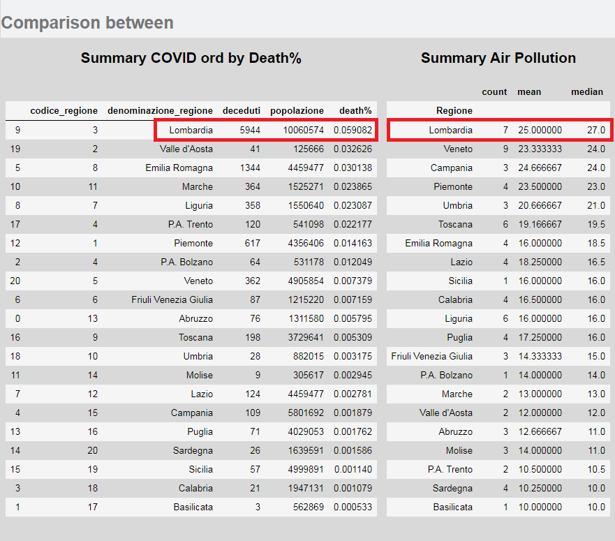
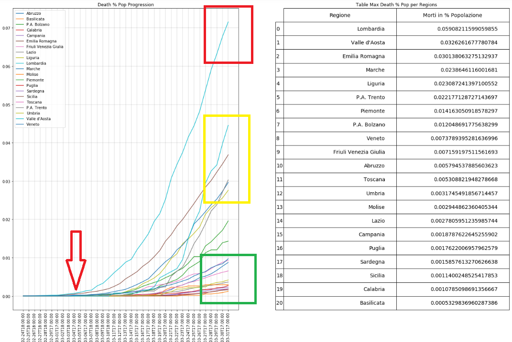
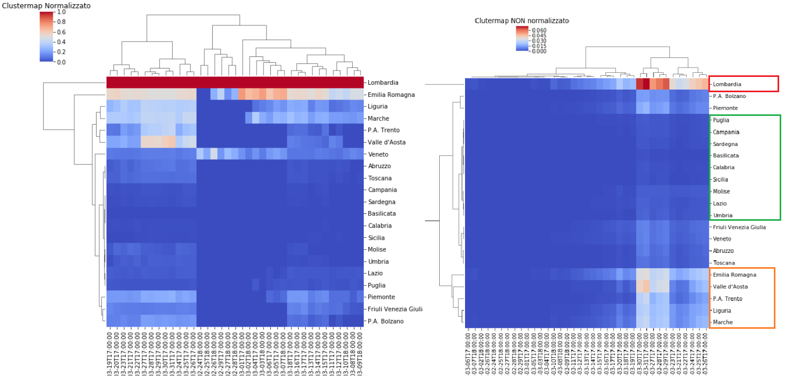
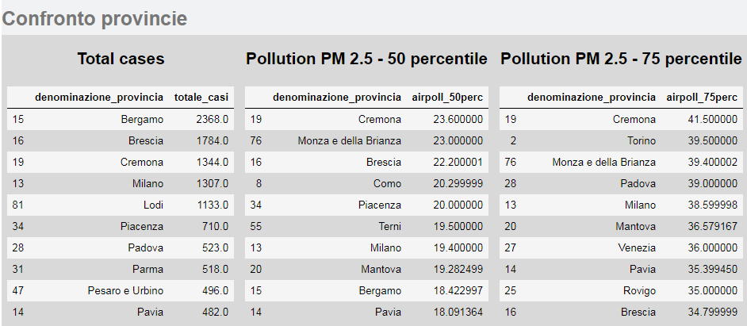
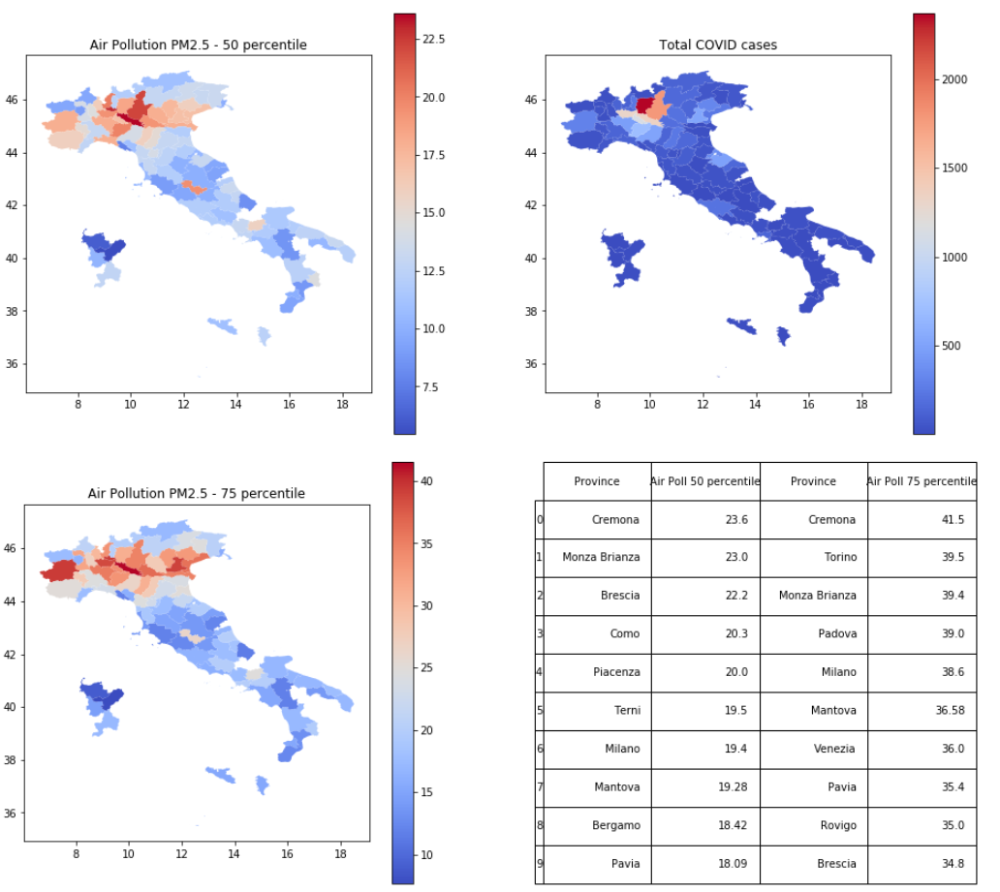

# Introduzione

###### Premetto che questa analisi va intesa come un semplice esercizio di manipolazione di dati, più che come uno studio di qualsivoglia utilità.

***

Con il seguente documento si vuole analizzare l'andamento della pandemia COVID-19 in territorio italiano, attingendo dai dati che la rete fornisce ad oggi, 26-Marzo-2020.

Le fasi che analizzerò saranno le seguenti:

1. Comprensione del problema

2. Acquisizione dei dati
   * Data cleaning
   * Data exploration & Feature Engineering
3. Predictive Modeling
4. Data Visualization
5. Conclusioni

# Comprensione del problema

La situazione è complessa in quanto ricca di variabili, quindi l'analisi della diffusione di questa patologia richiede la comprensione della:

* affidabilità dei dati che vengono forniti e su cui bisogna operare;
* tipologia della malattia.

#### I dati sono affidabili?

Questo punto deve prendere a sua volta in considerazione due aspetti:

1. il protocollo di raccolta dati tra Stati differenti;

2. a parità di protocollo (ossia all'interno dello stesso Stato) i dati raccolti che percentuale di casi riescono a coprire;

La risposta di queste due domande domande rischiano di inficiare qualsiasi analisi, o dare dei risultati poco credibili o utilizzabili, paragonabili ad un tiro di dadi.

> 1. I dati da me raccolti sino a questo momento, sulla base delle informazioni pervenute dai media ufficiali, mi portano a pensare che i protocolli tra i vari Stati non sono uniformi, in quanto l'attribuzione di una morte per COVID-19 non è uguale, il numero di tamponi eseguiti non sono proporzionalmente uguali. Per questo motivo ritengo non sia possibile trattare due Stati all'interno della stessa analisi, e limiterò il mio caso di studio al solo Stato Italiano.
>
> 2. Per quanto riguarda la quantità di dati raccolti, non avendo la possibilità di sapere se i dati forniti siano adeguati, prendo per buono che lo siano, e opererò sui dati forniti dalle fonti ufficiali nazionali.

#### La malattia

Agente virale che attacca in maniera aggressiva il sistema respiratorio, causando entro una certa percentuale, un'aggravamento della situazione terapeutica mutando in una polmonite interstiziale, sino, nei casi più gravi, alla morte del paziente.

> Anche circoscrivendo l'analisi del problema al solo Stato Italiano l'evoluzione della pandemia risulta molto differente. Questo mi porta a pensare che un'evoluzione differente, a parità di protocolli di cura, contenimento e riconoscimento, sia causata da situazioni differenti tra le varie regioni italiane. Gli agenti patogeni prolificano in situazioni adatte alla loro riproduzione, se la diffusione è differente in due gruppi di popolazione, forse non bisogna cercare nel virus ma nella popolazione.
>
> Uno spunto per questa considerazione mi è stato fornito da queste due foto:
>
> 
>
> Le foto senza bisogno di molte analisi dimostrano quantomeno una somiglianza, magari non ancora dimostrabile, ma sicuramente sufficiente per basare un'analisi. Nonostante la foto che riguarda l'analisi della concentrazione di PM2.5 sia datata 2005, gli eventuali danni al sistema respiratorio non sono recuperabili in 10/15 anni, ammesso che la situazione sia migliorata.
>
> La domanda che mi sono posto è stata:
>
> *"...puo' un virus che attacca il sistema respiratorio, trovare terreno fertile in una popolazione che vive respirando un'aria deleteria per il sistema respiratorio stesso?"*
>
> Approfondendo questo tema ho trovato alcuni articoli:
>
> https://www.lifegate.com/people/news/air-pollution-europe-eea
>
> http://www.ilmessengero.it/category/italia/
>
> https://www.agi.it/cronaca/ecco_come_abbattere_lo_smog_in_citt_il_decalogo_di_legambiente-1347212/news/2017-01-05/
>
> https://nova.ilsole24ore.com/infodata/scopri-la-mappa-mondiale-dellinquinamento-dellaria-nelle-citta/?refresh_ce=1
>
> https://www.repubblica.it/ambiente/2019/11/14/news/italia_prima_in_europa_per_le_morti_da_polveri_sottili-241031894/
>
> E presso fonti ufficiali governative:
>
> http://www.salute.gov.it/imgs/C_17_paginaRelazione_1438_listaFile_itemName_2_file.pdf
>
> 

#### Conclusioni

L'obiettivo di questa analisi sarà trovare correlazioni tra l'inquinamento dell'aria e la percentuale di morte per polmonite interstiziale causata da COVID-19 nelle regioni della sola Italia.  Il modello trovato può essere applicato a dati di altri singoli Stati, in modo che i protocolli non distorcano i risultati.

# Acquisizione dei dati

Per la mia analisi avrò bisogno di tre tipologie di dato:

* quelli relativi al COVID-19;
* quelli relativi all'inquinamento dell'aria;
* quelli relativi alla distribuzione demografica delle varie regioni.

#### I dati sul COVID19

Per quanto riguarda i dati sulla malattia non potrò fare affidamento su quelli forniti dalla **[John Hopkins CSSE](https://github.com/CSSEGISandData/COVID-19/tree/master/csse_covid_19_data/csse_covid_19_time_series)** in quanto non sono differenziati per le varie regioni Italiane.

I dati sono stati acquisiti attraverso il profilo Github della Presidenza del consiglio dei ministri - Dipartimento della Protezione Civile Italiana, nella sezione relativa al [COVID-19](https://github.com/pcm-dpc/COVID-19/tree/master/dati-regioni). Li ho scaricati e sono disponibili, per ciò che è relativo alla mia analisi, anche nella cartella [Data](Data/Covid19).

#### I dati relativi all'inquinamento dell'aria

I dati relativi dall'inquinamento dell'aria sono stati presi dal sito dell'[ISPRA](https://annuario.isprambiente.it/ada/basic/7080), nella cartella [Data](Data/air_pollution_data) sono salvati i documenti originali e i dataset da me estrapolati. Ho trovato anche i dati dell'[Eupean Enviroment Agency](https://www.eea.europa.eu/data-and-maps/data/air-pollutant-concentrations-at-station) relativi agli anni che vanno dal 2010-2016, tuttavia non li ho utilizzati perché presentano molti campi incompleti. Lascio il riferimento per eventuali controlli incrociati.

#### I dati relativi alla distribuzione demografica

Dimensionare i dati relativi alla malattia alla popolazione è di primaria importanza, in quanto le regioni si differenziano notevolmente per popolazione. I dati sono stati acquisiti dal sito [IStat](http://dati.istat.it/Index.aspx?QueryId=18545) e sono stati raggruppati in una tabella in formato csv nella cartella [Data](Data/demographic_data).

### Data Cleaning

In questa fase andrò ad esaminare i vari dataset per controllare non vi siano valori mancanti o errati.

Le operazioni riguardante questa fase saranno raccolti in un file ipynb ([data_cleaning.ipynb](data_cleaning.ipynb)) nella directory principale.

### Data exploration & Feature Engineering

L'obiettivo di questa fase è capire che valori posso utilizzare e nel caso creare nuovi dati relazionando vari valori, unendo tutto in una tabella dove è possibile.

Per quanto riguarda i dati sul COVID manterrò solo il numero dei deceduti, in quanto il numero dei contagiati non è attendibile. Infatti non sono stati fatti tamponi a tappeto su tutta la popolazione, pertanto il numero dei contagiati reale è sconosciuto. Inoltre la presenza di persone che sono totalmente asintomatiche rende l'analisi ancora più complicata.

Anche il valore che riguarda il numero degli ospedalizzati è difficile da utilizzare, in quanto il numero di posti disponibile negli ospedali è un dato difficile da recuperare e non è sempre proporzionale al numero di abitanti.
Per queste ragioni non considererò neanche questo valore. 

Il numero di morti per regione sarà messo in relazione al numero di abitanti, in un'analisi successiva inserirò anche la densità di popolazione per regione.

Aggiungerò anche la colonna relativa all'inquinamento dell'aria e l'etichetta relativa al superamento del limite consentito per legge. Se una regione contiene più di un dato, i dati verranno raggruppati e verrà presa la mediana.

Le operazioni riguardante questa fase saranno raccolti in un file ipynb ([making_main_table.ipynb](making_main_table.ipynb)) nella directory principale.

### Conclusioni relativa all'esplorazione dei dati

Queste due tabelle riepilogano i dati su cui andrò a realizzare le analisi iniziali e che riepilogherò in alcuni grafici. 

Si può notare che la Lombardia è in vetta ad entrambe le liste: quella relativa ai morti in percentuale, ai morti assoluti e l'altra relativa all'inquinamento (il dato dell'inquinamente si riferisce al 50°percentile).

I dati forniti dalla Protezione Civile si dividono in due grandi dataset:

* uno che contiene lo storico per regione dei casi accertati, degli ospedalizzati, ricoverati, terapia intensiva, isolamento e dei deceduti
* uno che contiene lo storico per provincia che, al contrario del precedente, non è così dettagliato e ha solamente lo storico del numero dei casi accertati per provincia.

Saranno analizzati il numero dei deceduti per le motivazioni espresse precedentemente per ora non considererò i dati provinciali.

***

I grafici successivi rappresentano l'evoluzione di 6 regioni, la Lombardia è stata l'apripista, assieme all'Emilia Romagna, del caso italiano , ed è stata anche la regione che ha subito il numero maggiore di casi e di perdite fino ad ora.

Inizialmente in Lombardia sono state adottate misure restrittive che dopo qualche settimana sono state estese al resto dell'Italia. L'aspetto centrale rimane la differenza di evoluzione tra questa regione e le altre, dobbiamo ricordare che:

* il giorno della comunicazione della chiusura dei confini lombardi ci fu un esodo di persone, che si spostarono dalla Lombardia alle altre regioni d'Italia, nonostante questo spostamento non ci fu una diffusione o un aumento dei casi in maniera esponenziale, come ci si aspettava dopo questo comportamento;
* diverse regioni non hanno rispettato in maniera rigida le misure governative e tuttavia non c'è stata una diffusione quantomeno pari a quella avvenuta in Lombardia.

Questi due punti fanno ipotizzare che in questa regione ci sia uno o più fattori che rendono il virus particolarmente pericoloso.

Il **<u>dati del grafico seguente sono stati proporzionati in base alla popolazione</u>** delle singole regioni.

Da questo primo grafico si possono iniziare ad ipotizzare indicativamente 3 gruppi:

* Lombardia
* Emilia Romagna, Marche, Valle d'Aosta, Liguria, P.A. Trento, Piemonte
* Il resto dell'Italia

L'aspetto di maggior risalto è quello indicato dalla freccia rossa, i primi casi appaiono nello stesso momento in Lombardia ed Emilia (Codogno e i paesi limitrofi si trovano al confine delle due regioni), tuttavia in Lombardia ha avuto una diffusione importante,  mentre in Emilia rimane molto più contenuta.

Si procede con lo studio delle correlazione tra inquinamento e decessi. Ho affiancato un heatmap con un semplice scatterplot per avere una visione più chiara dei dei due grafici.

Per quanto riguarda <u>decessi e inquinamente</u> il valore di correlazione è di <u>0.54</u>, che può considerarsi moderatamente correlato, ovviamente va ricordato che la ["correlazione non implica la causa"](https://en.wikipedia.org/wiki/Correlation_does_not_imply_causation), in altre parole: non è detto che sia la causa ma potrebbe essere uno dei fattori predisponenti, o una concausa, che rende ancora più deleteria la patologia. Altri dati utili per avere un quadro migliore potrebbero essere:

* la **densità di popolazione**, possibilmente suddivisa per fasce anagrafiche;
* l'**età dei deceduti**;
* **un indice che esprima la capacità di risposta sanitaria delle città/regioni** (ie numero di posti letto in terapia intensiva, raggiungibilità dei pazienti da parte dei soccorsi e del servizio sanitario)

Dati che per ora non sono in grado di ottenere.

Bisogna prendere atto che <u>l'indice di inquinamento è relativo all'intera regione</u>, infatti le stazioni di campionamento sono spesso sparse su tutto il territorio. Questo implica che l'inquinamento di comuni molto popolati, è spesso compensato da altri scarsamente popolati dove il tasso di inquinamento rientra sotto la soglia. Questo aspetto non da lo stesso peso all'influenza che l'inquinamento dei grandi centri ha sulla popolazione e sullo stato di salute generale.

|                  | Population | Air Pollution |
| ---------------- | ---------- | ------------- |
| città1           | 1.000.000  | 100           |
| città2           | 1.000      | 10            |
| città3           | 1.000      | 10            |
| media aritmetica |            | 40            |
| media ponderata  |            | 99.8          |

$$
Media\ Ponderata = \frac {\sum Wx}{\sum W}
$$

Appena possibile proverò ariformulare i dati regionali con una media ponderata tra popolazione e inquinamento.

I grafici successivi sono relativi  alle tabelle pivot costruite sui deceduti ed espressi tramite clusterplot. Ho utilizzato due serie di dati uno NON proporzionato alla popolazione e uno PROPORZIONATO alla popolazione. Inoltre ho realizzato un grafico normalizzato e uno non normalizzato.

Da questi due grafici si nota poco la differenziazione tra i vari gruppi, l'unica regione che risalta è sempre la Lombardia.

Le cose cambiano leggeremente proporzionando i dati.

(Per vedere le immagini più in dettaglio consultare il file making_main_table.ipynb nella directory principale)

I dati proporzionati risultano, a mio parere, più visibili, dalla clustermap si delineano la presenza di tre gruppi principali:

- Lombardia
- Marche, Liguria, Valle d'Aosta, Piemonte, Trentino Alto Adige, Emilia Romagna e Veneto
- le restanti regioni italiane tale suddivisione si può notare anche dall'andamento delle linee dei decessi nel grafico accanto, anche meno chiaro.

Per ora per i dati visualizzati non mostrano una relazione evidente tra inquinamento e morte per polmonite interstiziale da Coronavirus, tuttavia ricordiamo che la regione Lombardia, <u>l'unica con un valore superiore a quelli consetiti dalla legge</u>, è la regione che ha subito il maggior numero di decessi attribuiti all'azione del virus.

***

Seguono dei grafici geoplot per avere una visione forse più chiara dei dati. Utilizzerò due librerie differenti con approcci diversi, da una parte geopandas e dall'altra ipyleaflet

I primi due grafici sono rappresentati con una legenda cromatica semplicemente basata sui valori, negli altri due i dati vengono suddivisi in 5 classi tramite il classificatore Box Plot (o "Box and wiskers plot"), che combina i valori minimo e massimo (e quindi l'intervallo) con i quartili per evidenziare l'indice di dispersione dei valori

------

Eseguirò la stessa cosa anche per le provincie, il database non ha numeri riguardanti i decessi per provincia e dovrò utilizzare il valore relativo al totale dei casi. Le problematiche sono quelle discusse all'inizio: sono dei dati molto relativi, come quelli dei contagiati, e sopratutto in questo caso non ci sono neanche indicazioni relative al numero di posti letto per provincia. Quindi rappresenterò il totale dei casi indicato in relazione all'inquinamento dell'aria per provincia.

In questo caso mi mancano i dati relativi alla densità demografica provinciale, un valore che messo in rapporto all'indice di inquinamento, potrebbe esprimere il peso che l'inquinamento esprime sul territorio e sulla gente che lo abita.

Ho inserito anche il valore dell'inquinamento del 75° percentile, per avere una dimensione del range di inquinamento, ricordiamo che il valore limite annuale da raggiungere entro il 1 gennaio 2015 era fissato a 25 µg/m3, mentre entro il 1 gennaio 2020 il valore era stato fissato a 20 µg/m3. (secondo il D.Lgs.  155/2010, ricordo la relazione del [ministero dell'ambiente](http://www.salute.gov.it/imgs/C_17_paginaRelazione_1438_listaFile_itemName_2_file.pdf))

Anche in questo caso i questi primi tre grafici sono rappresentati con una legenda cromatica semplicemente basata sui valori, nei seguenti i dati vengono suddivisi dal classificatore Box Plot.

Infine quest'ultimo grafico realizzato con il modulo ipyleaflet ho dato un peso all'indice di inquinamento moltiplicandolo con la popolazione regionale, in attesa di ottenere i dati provinciali.

I dati sono relativamente pochi e incompleti, e l'epidemia non è ancora conclusa quindi non si può ancora capire se lo sviluppo avvenuto in Lombardia si replicherà nel resto dell'Italia.

La fase successiva, può permettere di delineare dei modelli per tentare di riconoscere il tipo di sviluppo della patologia nelle varie regioni.